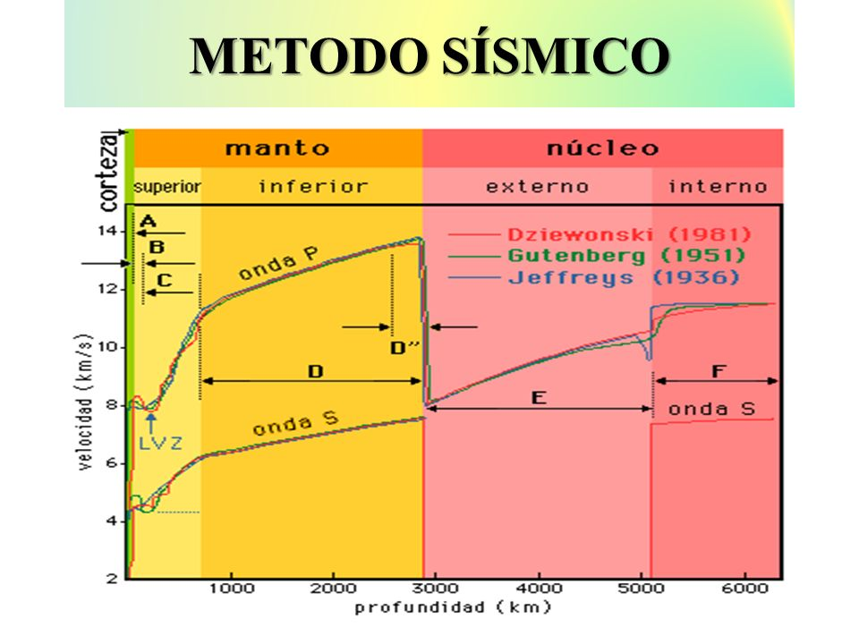
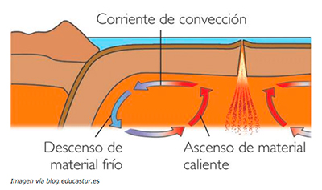
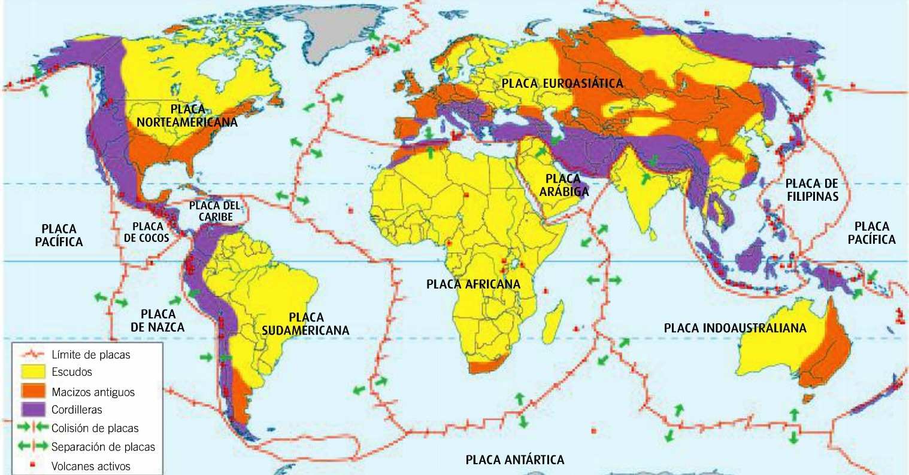
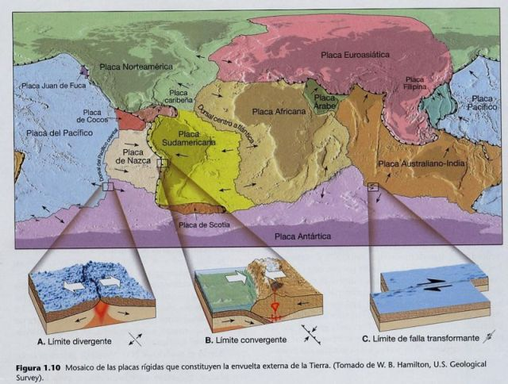
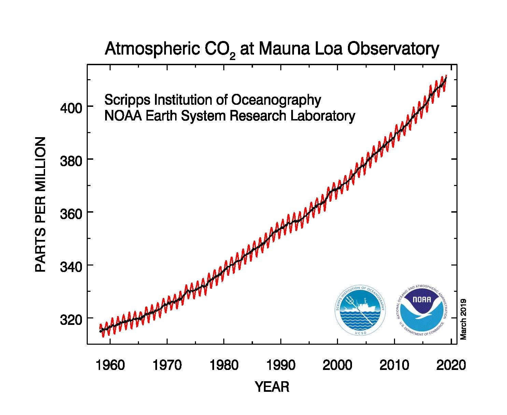

--- 
marp: true
math: katex
--- 

# Teorías previas

- En 1915 **Alfred Wegener** expone que hace unos 300 m.a. todos los continentes
  formaban un único continente llamado **Pangea**.
- La teoría de Wegener, llamada **teoría de la deriva continental** es la primera
  **teoría movilista** de la Tierra.
- Las teorías movilistas postulan que la Tierra ha cambiado a lo largo de su historia,
  frente a las **teorías fijistas**, que suponen que nuestro planeta ha tenido una
  historia estática.

---
# Métodos directos y métodos indirectos
- Métodos directos:
  - Observación de la superficie terrestre.
  - Sondeos y minas.
  - Erupciones volcánicas.
- Métodos indirectos. Están basados en cálculos y deducciones:
  - Magnetismo.
  - Meteroitos.
  - Gravedad.
  - Radioisótopos.

---
## El método sísmico
- Es un método indirecto que destaca por su importancia.
- Se basa en el estudio de la propagación de las vibraciones causadas por los terremotos.
  - Ondas P (principales). Son ondas longitudinales, 
  que se pueden propagar a través de cualquier medio.
  - Ondas S (secundarias). Son ondas transversales, por lo
  no pueden viajar a través de un medio líquido.
---

  

---
# Tectónica de placas
- Es la gran teoría unificadora que explica la gran variedad de acontecimientos
  y características de la Tierra.
- Asunciones:
  - La capa exterior o **litosfera** es rígida y se encuentra fragmentada.
  - La litosfera descansa sobre la **astenosfera**, que es semiplástica, más caliente
  y débil.
  - Las **placas litosféricas** se desplazan sobre la astenosfera, debido a la
  presencia de unas corrietes de convección.

---

  

---

- Los movimientos de las placas son los responsables de la aparición de 
  montañas, volcanes, sismos, plegamientos y fallas.
- También dan lugar a la expansión de los océanos y el desplazamiento de los
  continentes.
- Las principales placas son: **Africana**, **Antártica**, *Arábiga*, *Caribe*,
  *Cocos*, **Euroasiática**, *Filipina*, **Indoaustraliana**, **Norteamericana**,
  **Sudamericana** y del **Pacífico**.

---

--- 
## Tipos de borde

### Bordes destructivos
- Las placas colisionan y se destruye la litosfera.
- Reciben el nombre de **zonas de subducción**, o **fosas**.
- Se producen terremotos profundos y vulcanismo.
- Da lugar a arcos de islas y cordilleras.
### Bordes constructivos
- Los placas se separan y se produce un ascenso de material.
- Da lugar a las **dorsales oceánicas**.

### Bordes pasivos
- Las placas se mueven lateralmente una respecto a la otra.
- Se producen terremotos superficiales.
- Da lugar a **fallas transformantes**. 

---

--- 
# Atmósfera e hidrosfera

## Atmósfera
- La atmósfera es la capa gaseosa que rodea la tierra.
- Composición:
  - $N_2$: 78%.
  - $O_2$: 21%.
  - Argón: 0,93%.
  - $CO_2$: 0,04%.

---

---

- La atmósfera está compuesta por una serie de capas. Destacamos:
  - Troposfera. Donde se producen los fenómenos meteororológicos.
  - Estratosfera. Donde se encuentra la ozonosfera.
  - Mesosfera.

## Hidrosfera
- Está formada por todo el agua de la Tierra, ya sea en estado líquido,
  sólido o gaseoso.
- El ciclo del agua puede verse como una máquina que funciona con energía solar
  y que realiza erosión, movilización de materiales y modelado del relieve.

--- 

# El suelo
## Edafogénesis
- Es el proceso mediante el cual se forma a partir de las rocas el suelo.
- Etapas:
  - Alteración de la roca madre. Debido a los procesos de meteorización,
  tanto física como química.
  - Instalación de los seres vivos.
  - Mezcla de los componentes.

---
### Factores que influyen en la edafogénesis.
- La pendiente del terreno. La inclinación dificulta la formación del suelo.
- El clima. La humedad y la temperatura facilitan la edafogénesis.
- El tiempo. La formación del suelo es un proceso largo (hasta miles de años).
