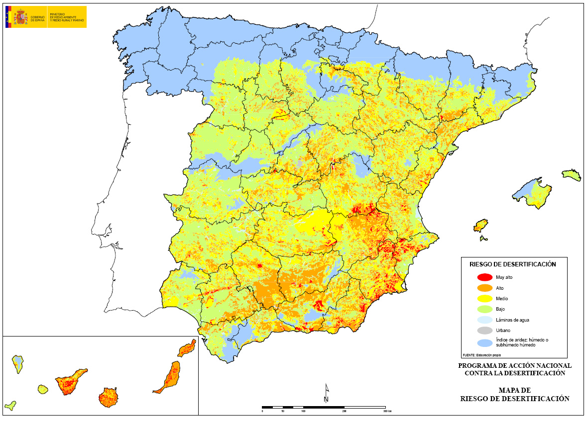
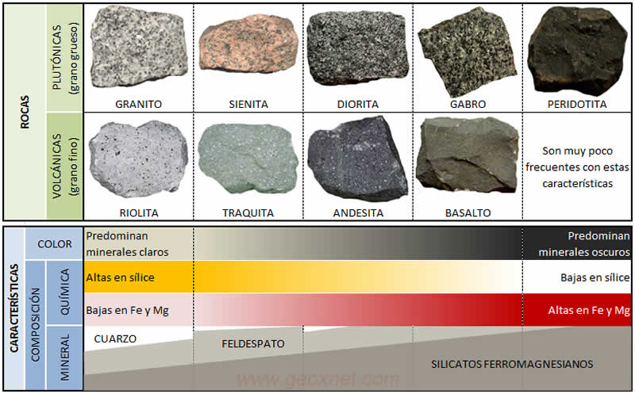

--- 
marp: true
math: katex
--- 
# Teorías previas
---

- En 1915 **Alfred Wegener** expone que hace unos 300 m.a. todos los continentes formaban un único continente llamado **Pangea**.
- La teoría de Wegener, llamada **teoría de la deriva continental** es la primera **teoría movilista** de la Tierra.
- Las teorías movilistas postulan que la Tierra ha cambiado a lo largo de su historia, frente a las **teorías fijistas**, que suponen que nuestro planeta ha tenido una historia estática.

---

# Métodos directos y métodos indirectos

---
- Métodos directos:
  - Observación de la superficie terrestre.
  - Sondeos y minas.
  - Erupciones volcánicas.
- Métodos indirectos. Están basados en cálculos y deducciones:
  - Magnetismo.
  - Meteroitos.
  - Gravedad.
  - Radioisótopos.

---

## El método sísmico

- Es un método indirecto que destaca por su importancia.
- Se basa en el estudio de la propagación de las vibraciones causadas por los terremotos.
  - Ondas P (principales). Son ondas longitudinales, que se pueden propagar a través de cualquier medio.
  - Ondas S (secundarias). Son ondas transversales, por lo no pueden viajar a través de un medio líquido.
  - 
---

  

---

# Tectónica de placas

---
- Es la gran teoría unificadora que explica la gran variedad de acontecimientos
  y características de la Tierra.
- Asunciones:
  - La capa exterior o **litosfera** es rígida y se encuentra fragmentada.
  - La litosfera descansa sobre la **astenosfera**, que es semiplástica, más caliente
  y débil.
  - Las **placas litosféricas** se desplazan sobre la astenosfera, debido a la
  presencia de unas corrietes de convección.

---

  

---

- Los movimientos de las placas son los responsables de la aparición de montañas, volcanes, sismos, plegamientos y fallas.
- También dan lugar a la expansión de los océanos y el desplazamiento de los continentes.
- Las principales placas son: **Africana**, **Antártica**, *Arábiga*, *Caribe*, *Cocos*, **Euroasiática**, *Filipina*, **Indoaustraliana**, **Norteamericana**, **Sudamericana** y del **Pacífico**.

---

--- 
## Tipos de borde entre placas
---

### Bordes destructivos
- Las placas colisionan y se destruye la litosfera.
- Reciben el nombre de **zonas de subducción**, o **fosas**.
- Se producen terremotos profundos y vulcanismo.
- Da lugar a arcos de islas y cordilleras.
---
### Bordes constructivos
- Los placas se separan y se produce un ascenso de material.
- Da lugar a las **dorsales oceánicas**.

### Bordes pasivos
- Las placas se mueven lateralmente una respecto a la otra.
- Se producen terremotos superficiales.
- Da lugar a **fallas transformantes**. 

---

--- 

# Atmósfera e hidrosfera

---

## Atmósfera

- La atmósfera es la capa gaseosa que rodea la tierra.
- Composición:
  - $N_2$: 78%.
  - $O_2$: 21%.
  - Argón: 0,93%.
  - $CO_2$: 0,04%.

- La atmósfera está compuesta por una serie de capas. Destacamos:
  - Troposfera. Donde se producen los fenómenos meteororológicos.
  - Estratosfera. Donde se encuentra la ozonosfera.
  - Mesosfera.

---

---

## Hidrosfera

- Está formada por todo el agua de la Tierra, ya sea en estado líquido, sólido o gaseoso.
- El ciclo del agua puede verse como una máquina que funciona con energía solar y que realiza erosión, movilización de materiales y modelado del relieve.

--- 

# El suelo

---
## Edafogénesis

- Es el proceso mediante el cual se forma a partir de las rocas el suelo.
- Etapas:
  - Alteración de la roca madre. Debido a los procesos de meteorización,
  tanto física como química.
  - Instalación de los seres vivos.
  - Mezcla de los componentes.

---

### Factores que influyen en la edafogénesis

- La pendiente del terreno. La inclinación dificulta la formación del suelo.
- El clima. La humedad y la temperatura facilitan la edafogénesis.
- El tiempo. La formación del suelo es un proceso largo (hasta miles de años).

---

## Tipos de suelo

* Arenosos. Son los más extendidos del mundo. Se encuentran en las zonas áridas y semiáridas.  Poca capacidad de retener el agua. Sostiene herbáceas y bosques ligeros.
* Limosos. Capacidad intermedia de retener el agua.
* Arcillosos. Tienen una gran capacidad de retener el agua.
* **Francos**. Tiene mezcla de arenas, limos y arcillas. Son ideales para los cultivos.
  Tienen buen drenaje y buena capacidad para retener el agua.
* Calcáreos. En regiones áridas. Vegetación escasa.
* Congelados.
* Volcánicos. Suelen ser muy fértiles.
* Pedregosos. Típicos de las zonas montañosas.

---

# Riesgos naturales

* Se puede definir como la vulnerabilidad de una población o región a
  una amenaza o un peligro natural.
---

## Clasificación

* Geológicos:
  * Vulcanismo
  * Terremotos
  * Tsunamis
  * Deslizamientos, aludes...
* Meteorológicos, climatológicos e hidrológicos:
  * Nieve y hielo
  * Lluvias intensas, granizo y tormentas
  * Inundaciones
  * Olas de frío y de calor
  * Vientos fuertes
* Biológicos: plagas y epidemias

---
## Predicción y prevención
* **Predecir** es anunciar con anticipación. Una de las medidas más comunes es la realización de *mapas de riesgo*.
* **Prevención**. Consiste en la aplicación de una serie de medidas adecuadas para mitigar los daños. Pueden ser de dos tipos:
  * **Medidas estructurales**. Se modifican las estructuras geológicas o las construcciones.
  * **Medidas no estructurales**:
    * *Ordenación del territorio*
    * *Protección civil*
    * *Educación*

---

---

# Minerales

* Un mineral es una sustancia natural, de composición química definida, normalmente sólido e inorgánico y que tiene una cierta estructura cristalina (sus átomos se disponen de manera ordenada, en figuras geométricas).

---

## Clasificación de los minerales

Los minerales se dividen en clases según el grupo con carga negativa predominante:
* Elementos nativos. Están formados por una única especie de átomos. Ejemplos: oro, plata, cobre, diamante, grafito...
* Sulfuros y sulfosales. Son combinaciones del azufre con metales o semimetales. Ejemplos: Galena ($PbS$) y Pirita ($FeS_2$)
* Halogenuros. Combinación de halógeno con metal. Ejemplo: halita ($NaCl$)
* Carbonatos y nitratos.
* Sulfatos.
* Fosfatos.
* Silicatos.

---
## Clasificación de las rocas
Las rocas se clasifican según su modo de formación u origen en tres grupos:
* **Ígneas**
* **Sedimentarias**
* **Metamórficas** 

---
### Rocas ígneas

* Las rocas ígneas, también conocidas como magmáticas son todas aquellas que se han formado por la solidificación de un material rocos, caliente y fluido denominado **magma**.
* Cuando la solidificación que se produce dentro de la litosfera, la roca resultante se denomina **plutónica**.
* Cuando la solidificación se produce en la superficie, la roca resultante se denomina **volcánica**.
* Debido a que el enfriamiento en el interior de la Tierra ocurre más lentamente, los cristales de las rocas plutónicas están más desarrollados (son más grandes) que los de las rocas volcánicas.

---

---

### Rocas metamórficas

* Las rocas metamórficas resultan de la transformación de rocas preexistentes que han sufrido ajustes estructurales y de composición bajo ciertas condiciones físicas o químicas, principalmente la presión y la temperatura.
* La roca original se transforma sin que pierda su estado sólido.
* Se clasifican según el tipo de metamorfismo.

---
#### Metamorfismo regional
* Es el mayoritario
* Ocurre en áreas muy grandes que están sometidas a temperaturas, presiones y deformaciones extremas.
* Característico de zonas de convergencia entre placas.

---

### Metamorfismo de contacto
* Se da cuando el calor y los fluidos magmáticos actúan para producir el cambio.

### Metamorfismo dinámico
* Se origina debido a la presión.
* Se asocia con zonas de fallas.